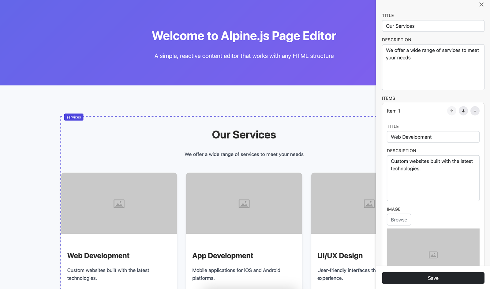

# Alpine.js Page Editor

Alpinejs page editor is an easy-to-use and intuitive on-page editor for any Alpine.js project. It will automatically generate the editor forms based on the structure of your data! Furthermore it features:

-   editing of single-line and multiline text
-   in-browser image upload and resize
-   support for adding, deleting and reordering items

# Preview



# Demo

https://alpinejs-page-editor.vercel.app

# How to use

First, include the necessary scripts and CSS at the bottom of your page:

```html
<!-- Page Editor CSS -->
<link rel="stylesheet" href="js/alpinejs-page-editor.css" />
<!-- Pica for image resizing -->
<script src="https://cdnjs.cloudflare.com/ajax/libs/pica/9.0.1/pica.min.js" integrity="sha512-FH8Ofw1HLbwK/UTvlNBxsfICDXYZBr9dPuTh3j17E5n1QZjaucKikW6UwMREFo7Z42AlIigHha3UVwWepr0Ujw==" crossorigin="anonymous" referrerpolicy="no-referrer"></script>
<!-- Page Editor js -->
<script src="js/alpinejs-page-editor.js"></script>
```

Then, wrap your page in:

```html
<div x-data="app" id="app"></div>
```

Make an element editable by adding the attribute: `x-editable`. Make sure the element's value corresponds to the corresponding key in data.json.

So to edit the hero section:

```json
{
    "hero": {
        "title": "Welcome to Alpine.js Page Editor",
        "subtitle": "A simple, reactive content editor that works with any HTML structure"
    }
}
```

and in your html:

```html
<!-- The value of x-editable should correspond to the key in your data, 'hero' in this case -->
<div x-editable="hero"></div>
```

Take a look at the demo to see how it works.

## Data structure

In order for the editor to automatically generate the necessary inputs, your data needs to adhere to a few conventions:

Each section in your site corresponds to a top-level object key in data.json. The value of this key should be and object.

If you name a key of that object `body` or `description` it becomes a multiline input (textarea). If you name it `image` ite becomes an image uploader. All other keys become single-line inputs.

```json
{
    "hero": {
        "title": "Welcome to Alpine.js Page Editor",
        "description": "A simple, reactive content editor that works with any HTML structure",
        "image": "img/placeholder.jpg"
    }
}
```

## Groups

But there's more: you can also add groups/arrays of items, which adhere to the same naming-convertions as above, but can be added/deleted and reordered! To add a sub-group of items, add a key called `items` which should be an array of objects. For example:

```json
{
    "services": {
        "title": "Our Services",
        "description": "We offer a wide range of services to meet your needs",
        "items": [
            {
                "title": "Web Development",
                "description": "Custom websites built with the latest technologies.",
                "image": "img/placeholder.jpg"
            },
            {
                "title": "App Development",
                "description": "Mobile applications for iOS and Android platforms.",
                "image": "img/placeholder.jpg"
            },
            {
                "title": "UI/UX Design",
                "description": "User-friendly interfaces that enhance the user experience.",
                "image": "img/placeholder.jpg"
            }
        ]
    }
}
```

## Run the demo locally

To run the project locally, run:

```bash
npx serve
```

This will start a local server on localhost:3000

## Press the :star: button

Don't forget to press the :star: button to let me know I should continue improving this project.
